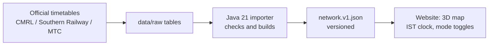

# Chennai Transit Sim - the plain-words version

**What it is.** A small 3D map of Chennai with moving dots for buses, suburban trains and Metro trains. It is a **simulation**. Nobody is tracking real vehicles. The dots are placed by the official published timetable and run times, and the clock is Indian Standard Time.

**What goes in.** Official timetables, copied into plain tables in `data/raw/`:
- CMRL (Metro) first/last train times and gaps between trains.
- Southern Railway suburban train times (the 1 June 2026 revision).
- MTC bus route lists and fares.
- Station and stop positions from OpenStreetMap.

**What happens in the middle.** A Java program (`importer/`) reads those tables, checks them, and writes one file: `data/build/network.v1.json`. That file has a version stamp. The website only reads that file. It never shows raw web text.

**What comes out.** At any time of day the map shows which services should be running and where each one is on its line. The counters at the top count simulated vehicles, not passengers. No passenger numbers are shown because none are published.

## Real example

```
INPUT  (data/raw/cmrl-timetable.csv)
  weekday, BLUE line, first train leaves Airport (APT) at 04:51

IMPORTER (Java)
  Blue line runs Wimco Nagar Depot ... Airport, 26 stations.
  Turns "04:51 from APT" + run times into a trip list in network.v1.json.

OUTPUT (website, clock = 04:55 IST on a weekday)
  A blue dot sits a few stations in from Airport, heading towards
  Wimco Nagar. The "Metro" counter shows 1 or more.
  At 04:30 the same line shows 0: no train has left yet.
```



## What is estimated

- Suburban stops: all trains are drawn as stopping at every station, because the stopping pattern is not in the source.
- Bus positions use assumed speeds (`data/raw/bus-assumptions.csv`).
- A few suburban trains in the source could not be read and are skipped. The importer lists them in the data file as warnings.
